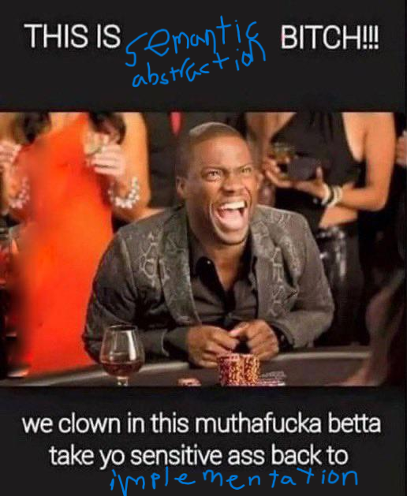

# Matei's notes

## 1. Introduction
- This paper seems so hype I can't wait to dig in 😋
- PL paper from the 70s try not to mention ALGOL 60 challenge (difficulty level: impossible)
- ALGOL 68 🤯
    - Kinda wanna learn ALGOL for the memes now lol
- [Approach in EL1](https://dl.acm.org/doi/abs/10.1145/360980.360992)

## 2. Illustrations of the type discipline
- ISWIM MENTIONED ISWIM MENTIONED!!!!!!!!!
- cons my beloved 
    - hd $\equiv$ car
    - tl $\equiv$ cdr
- Polymorphic means your type is a variable that gets assigned right when you actually need to test it
- Definiendum = term being defined, definiens = the definition
- Functions can have different types when we call them differently
    - That's why we use polymorphic types that iclude generic types in the type definition
- Recursive occurences of a formal definition must have the same type
- Fuck implementation we all abstract here



- The reason we give the two tags two seperate $\alpha$ is because since we use $let$ to define tag, we should assume that ... actually idk why there's two $\alpha$...
- If i have this right, when binding variables using $let$, we can only create new generic type variables when the variable is not bound by an enclosing $\lambda$
    - So what do they mean by "instantiated". Like they're saying that instantiation turned $\alpha$ into $\alpha_1$ and $\alpha_2$ when we used tag twice. But why would that happen in the first place? Wait no I think I got it. OHHHHHH I'm so smart. Its the thing where calling a fucntion different times can be called with different types and yield different types. So that's why you put in generic types for functions. But in the special case of let, sometimes you already have the type bound in your enclosed scope so you have to always use that variables type even when you are calling that function multiple times.
- No idea how to give an independent characterization of the class of programs that can be well typed in their system 💀. Whatever the fuck that means
- Wtf is that type equation for streams???
- Why is self-application ill typed?? Is bro gonna explain?
- $let\ F(f) = \lambda(a,b)\cdot(f(a),f(b))$ is not allowed since let prevents us from instantiating $f$ and it forces $a$ and $b$ to be the same type
- $let \text{ reversepair}=\lambda(x,y)\cdot(\text{reversepair}(x), \text{reversepair}(y))$ works since its not

## 3. A simple applicative language and its types

- WHat
- Domain 💀 (shubin moment)
- The language Exp makes so much sense thanks Milner!
- It's starting to make sense actually
- I would like to discuss the idea of a minimum element $\perp_D$
- I guess the interpreter makes sense
    - the wrongs happen on type errors
    - For example (if i understand correctly)
        - $v_1\mathbf{E}F\rightarrow(v_2\mathbf{E}W\rightarrow\text{ wrong, }(v_1|F)v_2),\\\hspace{25px}\text{wrong}$
        - This means that if $v_1$ is a function type then the first statement happens, otherwise we error out
        - Then in the parentheses if $v_2$ is the error type then we error, otherwise we constrict $v_1$ to function type and do application. So I think the $\mathbf{E}$ means if it is this type do the first statement, otherwise do the statement after the comma (most likely just an error)
    - extend env!
- CBV since we compute the value
- Last example in 3.4 since the function can lead to two different types $B_1$ or $B_2$
- Let's discuss difference between functionality and retract
- is prefix $\equiv\Gamma$ ???
- so far so good...
```lisp
(lambda (y)
    (let ((f (lambda (x)
                (x y))))
        (f y)))
```
$$
y:\alpha \\
x:\alpha\rightarrow\beta\\
f:(\alpha\rightarrow\beta)\rightarrow\beta\\
(let ... in ...):\gamma
$$
- $\alpha$ not **generic** since it was in the $\lambda y$, but $\beta$ is
- I LOVE NEW VOCABULARY WORDS!!!
- Lets talk about standard prefixed expressions
    - I think it means that generics can only happen in the prefix??
- Active means non shadowed bruh
    - Why am I bad at my left and right???
- Well typed definition (1)
    - for rule (iii) where is $\tau$???
- Well typed definition (2)
    - Ogey...
- BROOOO I was gonna say that the typing above is not well typed!!!
- Bro doing 241 proofs 💀

## 4. A Well-typing algorithm and its correctness

- Bro thinks just cuz it works means it is complete 💀. Bro obviosuly hasn't read Hoare's paper 💀. Classic mistake 💀. One I would never make myself 💀.
- What is unification 💀
- This section lost me... I'll leave it up to discussion

## 5. Types in extended languages
- side effects 🤯
- no proof 💀

## 6. Conclusion
This paper was very hype. I enjoyed it thoroughly. Got lost a little in section 4 but the rest was great.